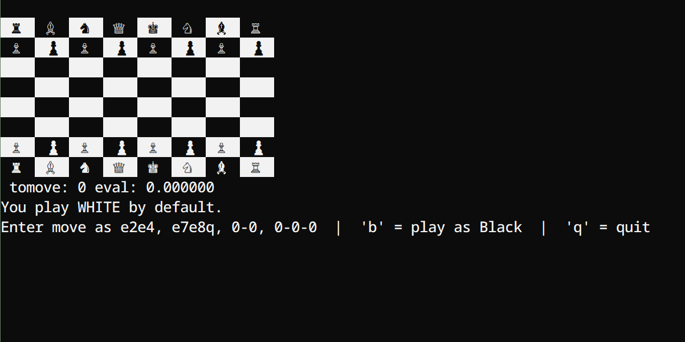

# bajeEngin
**Author - Chandan Das**

A simple UCI chess engine written in pure C.
Though it was written back in 2025, I'm licencing it on 2026

Current version: **0.07**

## Features
- Minimax search with alpha-beta pruning
- Basic evaluation with material + piece-square tables
- Supports castling, en passant, pawn promotion (to queen)
- UCI protocol compatible (works with Arena, Cutechess, Nibbler, en-croissant , etc.)
- Fixed depth search (currently depth 6)

## How to Build & Play

```bash
gcc -O3 -o bajeEngin bajeEngin07.c -lm
```
or just use the **Makefile**
You can play with it on terminal as,
```bash
make play
# or
bajeEngin play
```
This way you can play in CLI.



But I will prefer it to play in GUI.
Such as,
```
Arena, Nibbler, en-croissant
```
Chose ```/pathto/bajeEngin``` in their add engine option to play in GUI.


## Caution
**If It takes too much time to make move try changing the depth to smaller vlues**
